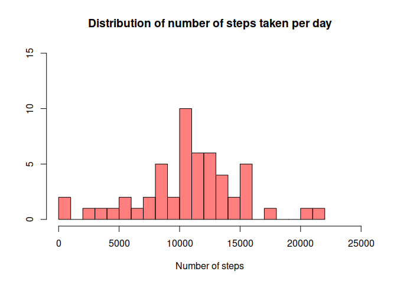
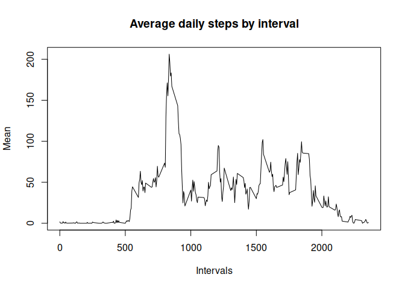
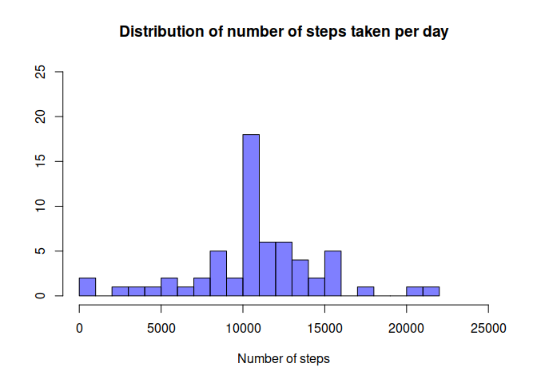
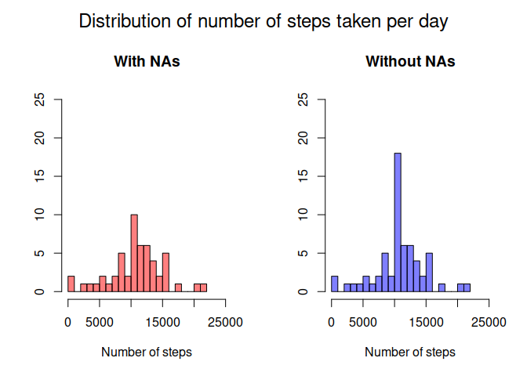
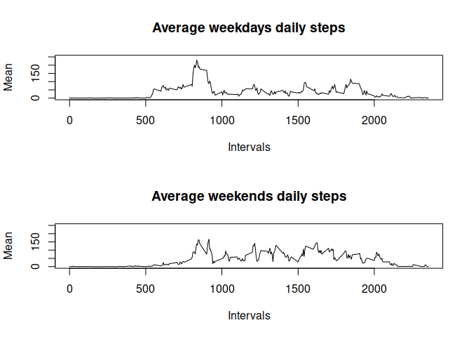

```r
options(digits=2) #Limit the digit part of floats to 2 digits
options(scipen = 999) # Allows to not Use the scientific notation when not necessary

library(dplyr) 
library(ggplot2)
```


This assignment makes use of data from a personal activity monitoring device. This device collects data at 5 minute intervals through out the day. The data consists of two months of data from an anonymous individual collected during the months of October and November, 2012 and include the number of steps taken in 5 minute intervals each day.


```r
# Read the data
data <- read.csv(unz("activity.zip", "activity.csv"))
```
 
## What is mean total number of steps taken per day?


```r
#Plottng histogram of the number of steps taken per day
daily_steps = group_by(data, date)
daily_sum = summarize(daily_steps, steps = sum(steps))
hist(daily_sum$steps, breaks=30, xlim=c(0,25000), ylim = c(0,15), col=rgb(1,0,0,0.5), xlab="Number of steps", ylab="", main="Distribution of number of steps taken per day" )
```

<!-- -->

 
 ```r
 # Daily steps mean and median calculation
 daily_steps_mean <- mean(daily_sum$steps, na.rm = TRUE)
 daily_steps_median <- median(daily_sum$steps, na.rm = TRUE)
 ```
 
The mean of daily steps is 10766.19 while the median is 10765.
 
 
## What is the average daily activity pattern?


```r
# Plotting the average daily steps by interval

interval_steps <- group_by(data, interval)
interval_steps_mean <- summarize(interval_steps, mean = mean(steps, na.rm=TRUE))
plot(interval_steps_mean$interval, interval_steps_mean$mean, type='l', xlab = 'Intervals', ylab='Mean', main = "Average daily steps by interval")
```

<!-- -->

```r
#Calculation of the 5-minute interval, on average across all the days in the dataset, contains the maximum number of steps
max_interval <- filter(interval_steps_mean, mean == max(interval_steps_mean$mean))
```

The 5-minute interval, on average across all the days in the dataset, contains the maximum number of steps is the 835 with 206.17 steps.

 
## Imputing missing values


```r
# Counting the missing values
steps_missing_values <- sum(is.na(data$steps))
```

In the dataset the feature "steps" has 2304 missing values.
I will substitute them with the mean inside their interval.


```r
# Make a copy of the dataframe
data_no_NA <- data.frame(data)

# Substitute the steps missing values with the average inside the interval
data_no_NA$steps[is.na(data$steps)] <- ave(data$steps, data$interval,FUN=function(x)mean(x,na.rm = T))[is.na(data$steps)]
```

## What is mean total number of steps taken per day?


```r
#Plottng histogram of the number of steps taken per day
daily_steps_no_NA = group_by(data_no_NA, date)
daily_sum_no_NA = summarize(daily_steps_no_NA, steps = sum(steps))
hist(daily_sum_no_NA$steps, breaks=30, xlim=c(0,25000), ylim=c(0,25), col=rgb(0,0,1,0.5), xlab="Number of steps", ylab="", main="Distribution of number of steps taken per day")
```

<!-- -->

 
 ```r
 # Daily steps mean and median calculation
 daily_steps_mean_no_NA <- mean(daily_sum_no_NA$steps, na.rm = TRUE)
 daily_steps_median_no_NA <- median(daily_sum_no_NA$steps, na.rm = TRUE)
 ```
 
The mean of daily steps is 10766.19 while the median is 10766.19.
The missing values imputation seemed to modify the median value, that now is identical to the mean.
 
 
## What is the average daily activity pattern?


```r
# Plotting the average daily steps by interval
interval_steps_no_NA <- group_by(data_no_NA, interval)
interval_steps_mean_no_NA <- summarize(interval_steps_no_NA, mean = mean(steps, na.rm=TRUE))
plot(interval_steps_mean_no_NA$interval, interval_steps_mean_no_NA$mean, type='l',xlab = 'Intervals', ylab='Mean', main = "Average daily steps by interval")
```

<!-- -->

The mean value of the intervals, not surprisingly, doesn't change.


```r
#Calculation of the 5-minute interval, on average across all the days in the dataset, contains the maximum number of steps

max_interval_no_NA <- filter(interval_steps_mean_no_NA, mean == max(interval_steps_mean_no_NA$mean))
```

The 5-minute interval, on average across all the days in the dataset, contains the maximum number of steps is the 835 with 206.17 steps.


```r
#Plotting the comparison between the distribution of number of steps taken per day of the imputted dataframe and the one containing NA values.

par(mfrow=c(1,2), oma=c(0,0,2,0))
hist(daily_sum$steps, breaks=30, xlim=c(0,25000), ylim = c(0,25), col=rgb(1,0,0,0.5), xlab="Number of steps", ylab="", main="With NAs" )
hist(daily_sum_no_NA$steps, breaks=30, xlim=c(0,25000), ylim=c(0,25), col=rgb(0,0,1,0.5), xlab="Number of steps", ylab="", main="Without NAs")
mtext("Distribution of number of steps taken per day", side = 3, line = 0, outer = TRUE, cex=1.5)
```

<!-- -->


The distribution of total number of steps taken each day only seems to increase the 10000 - 11000 interval, probabily because it was very affected by the existence of missing values.

## Are there differences in activity patterns between weekdays and weekends?


```r
#Creation of the "day_type" factor column with "weekday" and "weekend" values
#Note: my system is set to italian language: sabato=saturday and domenica=sunday
data_no_NA['day_type'] <- ifelse(weekdays(as.Date(data_no_NA$date)) == 'domenica' | weekdays(as.Date(data_no_NA$date)) == 'sabato', "weekend", "weekday" )
data_no_NA$day_type <- as.factor(data_no_NA$day_type)
```


```r
# Plotting comparison between average weekdays and weekend daily mean

day_type_steps <- group_by(data_no_NA, interval)
weekday_steps_mean <- summarize(filter(day_type_steps,day_type=="weekday"), mean = mean(steps, na.rm=TRUE))
weekend_steps_mean <- summarize(filter(day_type_steps,day_type=="weekend"), mean = mean(steps, na.rm=TRUE))
par(mfrow=c(2,1))
plot(weekday_steps_mean$interval, weekday_steps_mean$mean, type='l', ylim = c(0,250), xlab = 'Intervals', ylab='Mean', main = "Average weekdays daily steps")
plot(weekend_steps_mean$interval, weekend_steps_mean$mean, type='l', ylim = c(0,250), xlab = 'Intervals', ylab='Mean', main = "Average weekends daily steps")
```

<!-- -->


During the weekend the average steps taken in the maximum peak period of the weekdays (approximately between periods 800 and 1000) decreases, while some of the other periods seem to increase their means a little.


